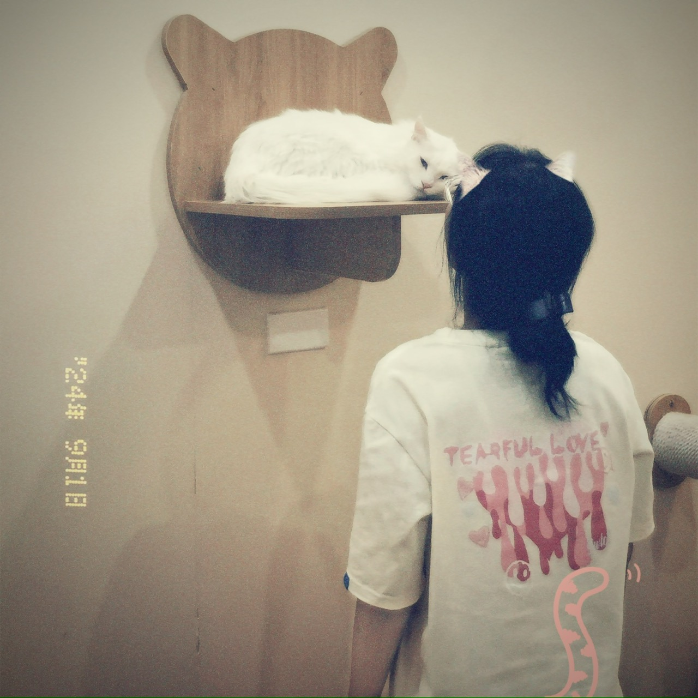

<html lang="vi">
<head>
    <meta charset="UTF-8">
    <meta name="viewport" content="width=device-width, initial-scale=1.0">
    
    <link rel="stylesheet" href="styles.css">
</head>
<body>
   
    <header>
        <h1>Chào mừng em đã đến hành tinh của anh</h1>
        
 ❤️ [Đào Nguyên Tiến Minh] ❤️ 
                          &
            ❤️ [Trần Hoàng Bảo Trâm] ❤️

          

            0 ngày bên nhau
        

    </header>

    <section id="story">
        <h2>Câu chuyện của chúng tôi</h2>
        
Anh và Em đã bắt đầu yêu từ ngày 31/12/2023. Sau nhiều kỷ niệm và khoảnh khắc đẹp bên nhau, anh và em đã trở thành một phần không thể thiếu trong cuộc sống của nhau.

    </section>

    <section id="gallery">
        <h2>Ảnh của chúng ta</h2>
        

            
            
            
            <!-- Thêm nhiều ảnh khác -->
        

    </section>

    <footer>
        
❤️ Với tất cả tình yêu của anh dành tặng cho em ❤️

    </footer>
    

        <button id="revealButton">Ấn zô đuy</button>
        

            Hôm nay là ngày tròn một năm bên nhau rồi . Nhớ lại những ngày đầu, anh chẳng nghĩ anh sẽ đồng hành với em suốt chặng đường này. Cảm ơn em vì đã ở bên anh, cùng chia sẻ mọi niềm vui, nỗi buồn.

            Anh thực sự hạnh phúc và trân trọng từng khoảnh khắc có em trong đời. Một năm qua là bước đầu thôi, và anh mong rằng chúng mình sẽ còn nhiều kỷ niệm đẹp hơn nữa trên hành trình phía trước. Yêu em nhiều! 💖
        

         <button id="secondButton" style="display: none;">Bấc ngờ nè</button>
        

            Một bấc ngờ nữa cho iem nè!
            
        

    

 <!-- Thêm thẻ audio tự động phát và tắt tiếng ban đầu -->
        <audio id="backgroundMusic" src="v14044g50000cp502c7og65lbm6ssi4g.mp3" autoplay muted loop></audio>
 
    

</body>

</html>
